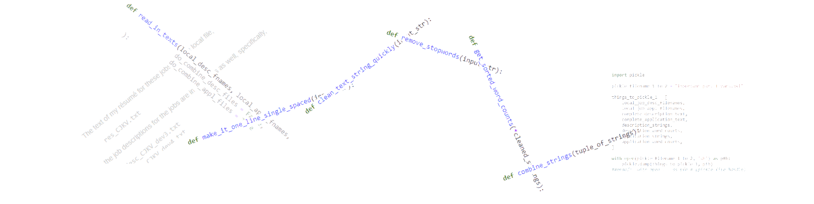
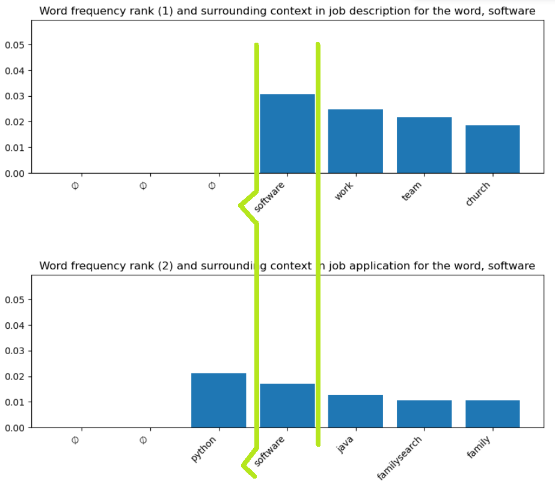
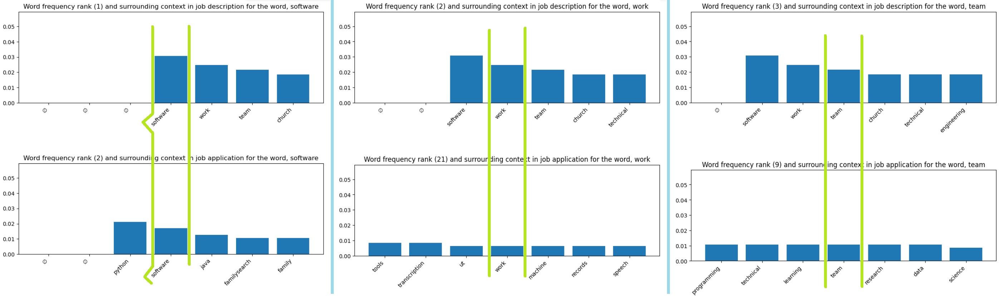

# portfolio-resume
A place to put links and pictures of projects I want potential employers to see.

At the current time, my suggestion is to use the Google CoLab Versions of
the Jupyter Notebooks (or the PDF versions) which will show input and output
of each cell of code.

If you have more time, it might even be better to look at the MyBinder
Version of the Jupyter Notebooks, since they are more interactive and it's
easier to keep the versions of programs compatible. It does take longer,
because a Docker image is getting created and served.

In additional to some fun projects with general programming, I'm going to put in
some of my favorite visualizations and Machine Learning work. Any of this stuff
could be completely-guided-from-tutorials or completely-original, or anywhere 
in between.

I'll just use links here, with each link pointing to a markdown file in the 
`porftfolio-resume` repo with. Each of these markdown files will have with a 
short description of the project and any visualization, some images with 
screencaps, and a link to the main repo; it will be a presentation page. Here, 
I'll be making a list of the projects with links to each presentation page I 
described above. There will also be a link to each actual repo with the 
full project. Since I leave the notebooks without output, so that you can run
through them yourself, I'm going to add two waysFinally, if I get things all 
figured out for them to work, I'll put a link to an online, interactive Jupyter 
Notebook made available thanks to the [MyBinder](https://mybinder.org/) project. 

# Higgs Boson Visualization

<b>Suggestion for Now:</b> If you want to be able to check things out quickly, 
use the CoLab specific notebook, which you can

`----------`

Can we get the data from the CMS experiment (part of the LHC) and (re-)discover
the Higgs Boson - also called the God Particle? You can judge for yourself. The
figure from my analysis is at top left. Two different views of the discovery
plot shown in the discovery publication are below and to the right of my plot. 

 

  

 

[<b>Higgs Boson Discovery</b> Presentation Page]([#https://github.com/bballdave025/visualization_portfolio/tree/main/higgs_boson#readme)

[`higgs_boson_visualisation` repo](https://github.com/bballdave025/higgs_boson_visualized)

[CoLab Version](https://colab.research.google.com/drive/1xROjIalylxzxJSDAM0fJ69pV1UEu9R7q?usp=sharing)

[MyBinder Version](https://mybinder.org/v2/gh/bballdave025/higgs_boson_visualized/main?labpath=Higgs_Boson_Discovery_Visualization.ipynb)

\[To put on the presentation page\]
This was my chance to return to grad school, where I studied Nuclear/Particle
Physics. The goal was to do the data analysis to "re-discover" the Higgs Boson - 
also called the God Particle. I got the data, prepared it, and ran the
analysis to create a histogram that looks pretty similar to the publicatin's
discovery figure. Below is a sneak peak at my work and the discovery figure.

# Do My Application and Résumé Match the Job Description?

<b>Suggestion for Now:</b> If you want to be able to check things out quickly, 
use the CoLab specific notebook, which you can

That link above is for part 4, which (I think) is the most interesting. Part 5 gives the results (currently for the 5 most frequently used words from the job description and the most frequently used word in the job application. If you have the time and the inclination, part 3 is the next one I'd suggest. All parts are linked below. Note that here, as with the other Google CoLab Notebooks, the point is to give a notebook with the input and the output. For some, you might be able to re-do the code running. For others, the versions of Python and the libraries won't be compatible. You can also see the MyBinder versions near the end of this section.

[part 1](https://colab.research.google.com/drive/1ZpNF9GFrj2aFHmHxZQe4ARK8yh8yCMB9?usp=sharing)

 

  

 

[part 2](https://colab.research.google.com/drive/13jVnZEocQLfVK2u9pWrae4-KkGghojSk?usp=sharing)

[part 3](https://colab.research.google.com/drive/1nZK2W8yux9u9sX4yz5n7Ok_WiIXgAzdh?usp=sharing)

[part 4](https://colab.research.google.com/drive/1ivJGeQwJ9Jt7bJx66ji6UUz7TsI6dQNa?usp=sharing)

 

  

 

[part 5](https://colab.research.google.com/drive/1Ko2WImQPvi0HeQ9Lue1TUhOK1Kyhz_3_?usp=sharing)

 

  

 

<strike>Note that you can't jump from one part to another inside of the CoLab notebooks. You'll need
to keep coming back to this README to click on the CoLab links (the `part 1`, `part 2`, etc.
links above).</strike> I think I've fixed it so that you can go sequentially through the parts
in CoLab, but I haven't thoroughly tested it. Coming back here is also useful if you want to 
see things out-of-order.

`----------`

This is a nice project that contains some fundamental parts of Natural Language
Processing. I use it for my job applications. Currently, I'm thinking about
running it for a job that really interests me, using AI/ML and Data Science to 
help in the medical-imaging business, but I'm not sure if the potential
employer would like to have the job description out where everyone can find it.

[<b>Check Match between Job Description and Job Application</b> Presentation Page (not yet set up)](#)

[`job-app-word-freq` repo](https://github.com/bballdave025/job-app-word-freq)

[MyBinder Version](https://mybinder.org/v2/gh/bballdave025/job-app-word-freq/polished-5part-presented?labpath=Part_01_NLPPresentationJobHunt_DemoWordFreq.ipynb)

# Convolutional Neural Network for Natural Language Processing - CNN for NLP (in PyTorch)

<b>Suggestion for Now:</b> If you want to be able to check things out quickly, 
use the CoLab specific notebook, which you can

`----------`

This is a better answer to a job interview question that I felt I didn't answer very
well. It's a nice combination of NLP and Machine Learning basics.

[<b>CNN for NLP in PyTorch</b> Presentation Page (not yet set up)](#)

[`nlp_w_pytorch_zhongyu-pan` repo](https://github.com/bballdave025/nlp_w_pytorch_zhongyu-pan)

[CoLab Version](https://colab.research.google.com/drive/1PKkdbNcqUfV0sHCosWZf3JdF6F3kGoj7?usp=sharing)

\[To put on the presentation page\]
This is my favorite, nice, and simple code for a simple CNN, created using PyTorch. I
really like how I did the first part - using the (Transformer-type/LLM) AI to do each
of the steps described by the teacher in the course this project follows. That course is
[_Natural Language Processing with PyTorch_](https://www.linkedin.com/learning/natural-language-processing-with-pytorch/), 
taugh by Zhongyou Pan. Note that the previous link is to a LinkedIn course, and thus will require a login, 
which itself will require an account.

# One of the Classics - CNN for MNIST Digit Recognition (in TensorFlow)

Can we read the numbers in zip codes that people write on their Post-Office envelopes?
The MNIST digit database and challenge give us the chance to find out.

[<b></b>Presentation Page (not yet set up)](#)

[`envelope-zip-reading` repo](https://github.com/bballdave025/envelope-zip-reading)

@TODO: I'll need to include information about how to set up the directories used
in the project in the CoLab Runtime machine.

[CoLab Version with Single-Hidden-Layer Approach](https://colab.research.google.com/drive/1XS-Mly_sn-CezqaA5Ksj36pn6Kv1twrH?usp=sharing)

[CoLab Version with CNN Approach](https://colab.research.google.com/drive/1ta1gFaxWkX57PJsvGrhGrlWfxdHb1u2a?usp=sharing)

# My Computer Vision / Manuscript Studies Paper - Finding Pieces of Older Books that Bind Old Books

Some of the most exciting finds in Manuscript Studies are previously unknown books in
the binding of other books. Important finds - works previously believed to be lost as
well as untapped genealogical data - come as researchers look at what book-binders
called waste and used to bind and protect other works.  We bring Machine Learning and
Artificial Intelligence into the search.

Here are some images of the kind of things for which we're searching and which we've found.

 

  

 

 

  

 

 

  

 

 

  

 

These images are details of interesting finds in the dataset I've been building and using.

Things are more interesting if the images are bigger; but I didn't use the right format above for easily seeing the images full-size.
The previous links go to GitHub file information pages and have alt-text for the seeing impaired and those wanting more info. 
The following links will go to images, as long as your browser isn't
set up for download. Make sure you use the zoom functions.

<b>Edit:</b> [Apparently](https://stackoverflow.com/questions/31558605/zoomable-image-in-markdown#comment80743279_31561231) ([archived](https://web.archive.org/web/20240108223632/https://stackoverflow.com/questions/31558605/zoomable-image-in-markdown)), 
zooming in on GitHub images is a bit complicated. I have a new `@todo` - come back and figure out how to give you zoomable
images without you needing to download them. <strike>I think you can click on these next images and see full-size and/or zoomable images.</strike>

<!-- Try 1: No

~~

~~ Try 2: No
 

  

 

  

 

  

 

  

 
-->

The presentation of the project would be better with some graphs of loss/accuracy curves, etc., but I wanted to get the pretty
stuff in first. `@todo` - Get loss/accuracy curves.

<b>I'd personally suggest you start with this following slide deck.</b>

[Slide Deck from Conference Presentation on GitHub](https://github.com/bballdave025/manuscript-waste-reuse-finder/blob/main/RestOfStory_-_MSReuseAsFHInfo.pdf)

Here are things with code, paper, and presentation.

[`manuscript-waste-reuse-finder` repo](https://github.com/bballdave025/manuscript-waste-reuse-finder)

[Paper on GitHub](https://github.com/bballdave025/manuscript-waste-reuse-finder/blob/main/BLACK-D_and_PRISBREY-K_-_FHTC_2024_-_Reused_Manuscript_Fragments_update_2024-02-21.pdf)

[Paper on Academia.edu - Free Account Needed for Access](https://www.academia.edu/120229768/Manuscript_Fragments_Reused_in_Bindings_as_Untapped_Genealogical_Sources_Opportunities_for_Family_History_and_Manuscript_Studies_to_Easily_Provide_Information_for_One_Another_All_with_the_Help_of_Machine_Learning)

# Hooray! An Excuse to Learn the R Programming Language!

<b>Suggestion for Now:</b> If you want to be able to check things out quickly, 
use the CoLab specific notebook, which you can

[repo](https://github.com/bballdave025/start-pirate-now)

[CoLab Version](https://colab.research.google.com/drive/1rTy0LddIzkiCAHC4j5JefKp25ZpaQuEX?usp=sharing)

